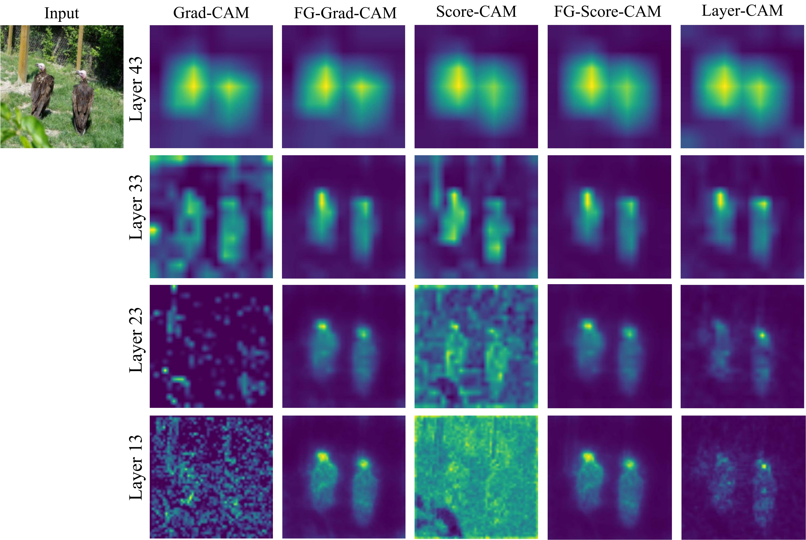

# Empowering CAM-based Methods with Capability to Generate Fine-Grained and High-Faithfulness Explanations

We develop a novel post-hoc visual explanation method called FG-CAM, which solves the problem that
CAM-based methods cannot generate fine-grained explanations without changing their characteristics, and achives SOTA.

</img><br/>


## Introduction
Implementation of [Empowering CAM-based Methods with Capability to Generate Fine-Grained and High-Faithfulness Explanations].

Our method can generate fine-grained visual explanations with high faithfulness in shallow 
and intermediate convolutional layers as well as in the input layer.

Method consists of 3 phases:

1. The explanation components are calculated using a CAM-based method in last convolutional layer.

2. Improve resolution of the explanation components.

3. Summing the processed components to obtain fine-grained explanations.

</img><br/>


### Example commands
By running main.py, FG-CAM results of images in the images folder can be saved in the results folder.

If the target layer is not the input layer, the base cam explanation is also obtained for comparison.

```
python main.py --model vgg16_bn --base_cam grad_cam --target_layer 13                         for the 2nd maxpooling layer of VGG16 with batch normalization
python main.py --model vgg16_bn --base_cam grad_cam --denoising True --target_layer -1        for the input layer of VGG16 with batch normalization
```
1. Model: vgg16, vgg16_bn and other modules folder implemented models by --model. 
2. Base cam: Which CAM-based method to use to obtain explanation components, score_cam or grad_cam by --base_cam.
3. Dnoising: Whether to use FG-CAM with denoising or not by --denoising.
4. Target layer: The target layer for which explanations need to be generated by --target_layer.
5. Target class: class of interest, input as a index, default model's predicted class by --target_calss.
